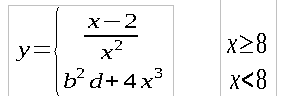

Смысл в том что при x >= 8 выполняется первая строчка системы уравнений,
а при x < 8 выполняется вторая строчка системы уравнений.

```
package kre_15_lab01;

import java.util.Scanner;

public class Lab01 {

    public static void main(String[] args) {
        try {
            Scanner scan = new Scanner(System.in);

            System.out.println("Консольная программа на JAVA");
            System.out.print("Введите X(число):");
            double x = scan.nextDouble();
            System.out.print("Введите А(число):");
            double b = scan.nextDouble();
            System.out.print("Введите B(число):");
            double d = scan.nextDouble();
            double y = 0;

            if (x < 8 && x != 0) {
                y = (x - 2) / (Math.pow(x, 2));
                System.out.format("Y=%.3f", y);
            }
            if (x == 0) {
                System.out.print("ноль в знаменателе!");
            }
            if (x >= 8) {
                y = ((Math.pow(b, 2)) * d) + (4 * (Math.pow(x, 3)));
                System.out.format("Y=%.3f", y);
            }
            System.out.println();
        } catch (Exception e) {
            System.out.println("Входные параметры заданы неверно!");
        }
    }
}
```
